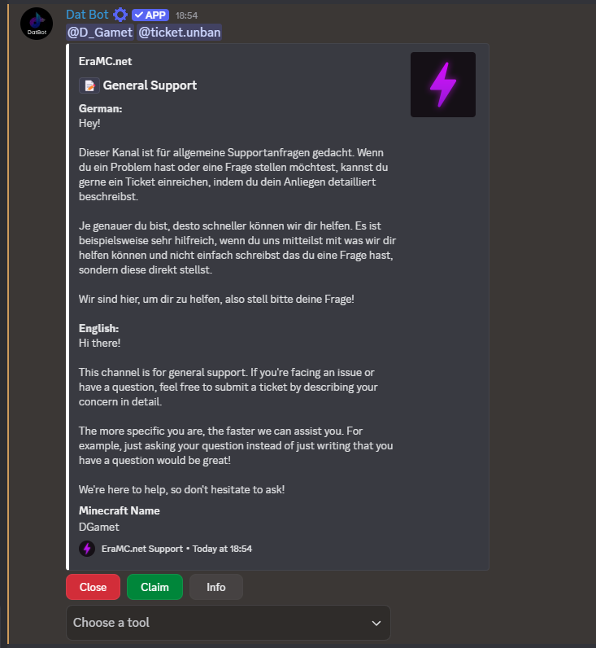

# TempVoice

### Presets

Presets are used to create a TempVoice Channel with customized settings.

#### Possibilites

<figure><figcaption></figcaption></figure>

#### Create and use

Create a preset with `/tempvoice presets create [name]` and customize your settings. You can edit an existing preset with `/tempvoice presets edit [preset]`.

To use a preset, use the command `/tempvoice presets load`. If you don't wanna use the preset anymore, use `/tempvoice presets unload`.

#### Permissions

You can add custom permissions by clicking on `[+] Permissions`. You can add permissions for a user or a role, the user permissions are global, the role permissions are for the guild you edit the preset on. It uses a custom permission system that allows you to specificly allow actions.

* <mark style="color:red;">Administrator</mark>: Instead of giving every other single permission, you can give this permission instead.
* <mark style="color:red;">Manage Bans</mark>: Ban or unban users
* <mark style="color:red;">Manage Moderators</mark>: Manage the TempVoice channel moderators
* <mark style="color:yellow;">Manage Channel Properties</mark>: Manage the name, bitrate, userlimit, status (currently not available), region, NSFW status and video quality
* <mark style="color:yellow;">Kick Members</mark>: Disconnect members
* <mark style="color:blue;">Manage Locking</mark>: Lock or unlock the channel
* <mark style="color:blue;">Manage Visibility</mark>: Make the channel visible or invisible
* <mark style="color:blue;">Manage Invites</mark>: Invite users or remove invites. They can join even if the channel is invisible and/or locked.

<figure><figcaption></figcaption></figure>

### Permissions

* **Admin**: Users on the server who have the permission Administrator
  * Manage the server settings: ✅
  * Manage a temporary voice channel: ✅
* **Server Mods**: Users with the moderation role (a role you can set so members with this role can manage temporary voice channels, but do not need actual permissions like Administrator)
  * Manage the server settings: ❌
  * Manage a temporary voice channel: ✅
    * _Note: They can not add or remove moderators, but can take over the channel to do t_
* **TempVoice Owner**: The owner of a temporary voice channel
  * Manage the server settings: ❌
  * Manage a temporary voice channel: ✅
* **TempVoice Mods:** The tempvoice owner can select moderators
  * Manage the server settings: ❌
  * Manage a temporary voice channel: 🔵
    * Kick users ✅
    * Lock and unlock the channel ✅
    * Change the name ✅
    * Change the user limit ✅
    * Invite users ✅
    * Remove invitations ✅
    * Everything else: ❌

<table><thead><tr><th width="223">Permission</th><th width="81">Admin</th><th width="96">Server Mods</th><th width="244">TempVoice Owner</th></tr></thead><tbody><tr><td>Manage the system settings (server)</td><td>✅</td><td>❌</td><td>❌</td></tr><tr><td>Manage the temporary voice channel</td><td>✅</td><td>✅</td><td>✅</td></tr></tbody></table>

### Restrictions

#### Server ban

<figure><figcaption>
This is how the error message looks if you have been banned.
</figcaption></figure>

* This error appears if you have been banned from the system by a server moderator.&#x20;
* This ban is not global.
* This means that you can no longer create or manage temporary voice channels.

#### How to remove a server ban

_<mark style="color:yellow;">Note: To be unbanned, you have to ask an Administrator to unban you.</mark>_&#x20;

1. The moderator has to use `/tempvoice settings`
2.  &#x20;

    <figure><figcaption>
Click on the emoji for Moderation settings
</figcaption></figure>
3.

    <figure><figcaption>
Click on the emoji to remove a block
</figcaption></figure>
4.

    <figure><figcaption>
Select the user who has been blocked with the select menu. If the user is not showing up, search with the username or the ID.
</figcaption></figure>

5.  If everything worked, you should see a message like the one below this text. The user is not able to use the system again.&#x20;

    <figure><figcaption>
The bot responds with this message if the user has been unbanned.
</figcaption></figure>

### Functions

* Moderation
  * Blocking users: You can block users. They cannot create and manage temporary voice channels while they are blocked.
  * Logging: It works in principle like the Discord Audit Log, but is for temporary voice channels. All actions, for example renaming the channel, are logged.
  * Moderation Role: By default, you must have the permission Administrator to be able to manage the system. People who have this role can manage the temporary voice channels, but not the system settings themselves. See also: [#permissions](tempvoice.md#permissions "mention")
* Channel customization
  * You can manage the temporary voice channel with the interface.
  * You can manage privacy, users and the channel.
  * Privacy
    * Lock the channel
    * Unlock the channel
    * Make the channel visible
    * Make the channel invisible
  * Channel
    * Set bit rate
    * Set name
    * Set status (As of March 07, 2024, this is not working yet)
    * Set region
    * Set userlimit
    * Set NSFW
    * Set video quality
    * Delete channel
  * Users
    * Invite user
    * Remove invitation
    * Ban user
    * Unban user
    * Kick user
    * Transfer ownership
    * Add moderator
    * Remove moderator

### Set-Up

1. Use /tempvoice setup and click in the "Continue" button.
2.  Select the type.

    Quick: If you choose this option,  the bot creates a category, a text channel, in which it sends the interface and creates a voice channel, which is functioning as the creator channel.

    Manual: Set the creator channel and send the interface manually

<figure><figcaption>
You have to click on the select menu to select a type.
</figcaption></figure>

3. If you chose "Quick", the bot will create everything for you. If you want to change settings, use `/tempvoice settings`
4. If you chose Manual, you first have to choose, which voice channel the creator channel should be.&#x20;

<figure><figcaption>
Click on the select menu to choose a voice channel. If it does not show up, type in the name of the voice channel.
</figcaption></figure>

5. After doing so, you have to send the Interface. Choose a channel and the bot will send the interface in this channel.

<figure><figcaption>
Click on the select menu to choose a channel. The bot sends the Interface in this channel.
</figcaption></figure>

<figure><figcaption>
The Interface as of March 07, 2024
</figcaption></figure>

### Commands

* `/tempvoice settings`&#x20;
  * Manage the server settings of the TempVoice system.
* `/tempvoice setup`
  * Use this command to set up the TempVoice system.
* `/tempvoice sendinterface`<mark style="color:orange;">`[channel]`</mark>&#x20;
  * Send the interface in the provided <mark style="color:orange;">\[channel]</mark>.
* `/tempvoice presets create`<mark style="color:orange;">`[name]`</mark>
  * Create a TempVoice preset. Use the <mark style="color:orange;">\[name]</mark> to identify the preset.
* `/tempvoice presets edit`<mark style="color:orange;">`[preset]`</mark>
  * Edit the provided <mark style="color:orange;">\[preset]</mark>.
* `/tempvoice presets info`<mark style="color:orange;">`[preset]`</mark>
  * Get information about the provided <mark style="color:orange;">\[preset]</mark>.
* `/tempvoice presets delete`<mark style="color:orange;">`[preset]`</mark>
  * Delete the provided <mark style="color:orange;">\[preset]</mark>.
* `/tempvoice presets load`<mark style="color:orange;">`[preset]`</mark>
  * Load <mark style="color:orange;">\[preset]</mark> as your default preset and apply it's changes upon creating a TempVoice channel.
* `/tempvoice presets delete`
  * Remove the default use of the used preset.

### FAQ

* Am I able to give extra permissions to the user who creates the TempVoice channel instead of just <mark style="color:green;">Connect</mark> and <mark style="color:green;">View Channel</mark>?
  * Yes, you are. Use `/tempvoice settings` > click on the button with the checkmark > Click on "Manage extra TempVoice Owner Permissions"
* Am I able to give the possibility of creating TempVoice channels to just certain roles?
  * Yes. Use `/tempvoice settings` , click on the button with the checkmark and click on the button with the key symbol. You can set the required roles and even choose whether the user needs all of them or just one.
* What are InVoice Roles?
  * InVoice Roles are roles that are given to users who are in a TempVoice channel. If they leave the TempVoice channel, they will get the Invoice Roles removed.
