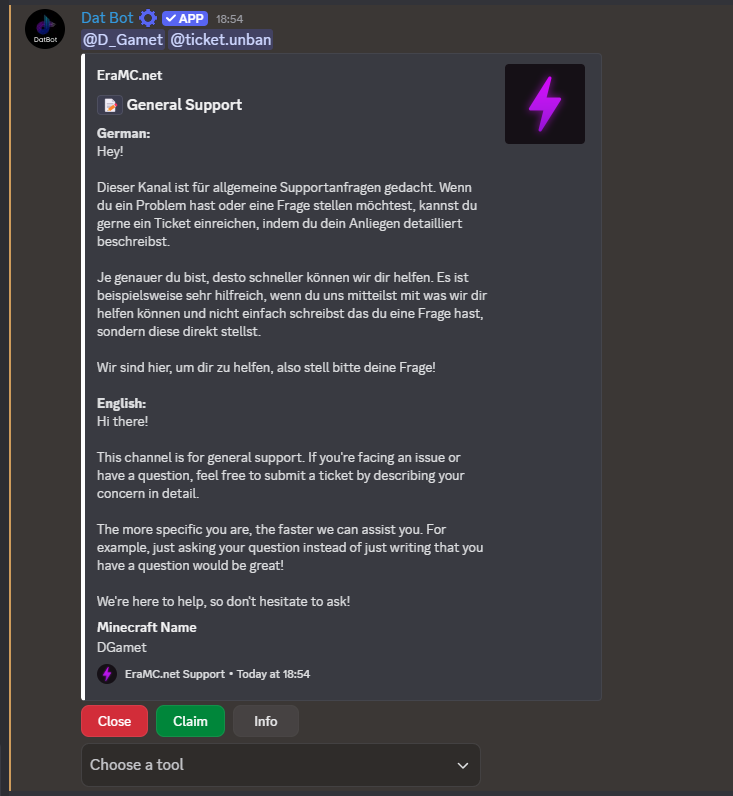

# Ticket Usage

After creating a Ticket, this message will appear. The content and embed will be different, but this section is about the components under the embed.

<figure><figcaption></figcaption></figure>

### "Close"/"Open"

* Clicking on this button closes or opens the ticket. This action is logged. Requires "Close"/"Open" or "Admin" permission.

<figure><figcaption></figcaption></figure>

This is how it looks like if the ticket is closed. The "Close" button turned into the "Open" button.

### "Claim"/"Unclaim"

* Claim or unclaim a ticket. This action is logged. Requires "Claim" or "Admin" permission. If claimed, Unclaim unclaims the ticket. This only works if you are the one who claimed the ticket. How to force claim a ticket: [#ticket-claim-less-than-ticket-greater-than-less-than-force-greater-than](commands.md#ticket-claim-less-than-ticket-greater-than-less-than-force-greater-than "mention")

### "Info"

* Includes basic ticket information and a log that includes: close, reopen, claim, unclaim and closerequests. Requires "Info" or "Admin" permission.

### Transfer

* Transfer a ticket. Read more here: [transfers.md](transfers.md "mention") and [#transfers](concepts.md#transfers "mention")

### Send a close request

* Users or staff members with the permission "Closerequest" or "Admin" can send a close request. This action is logged. Read more here: [#closerequests](concepts.md#closerequests "mention")

### Add users to ticket

* Add users to the ticket. These users are able to write messages and view the channel.&#x20;

### Read users to ticket

* Remove users from ticket. They will not be able to send messages or view the channel anymore.

### Block users

* Block the user that created the ticket globally or for this ticket category.

### Transcript

<figure><figcaption></figcaption></figure>

* By clicking transcript, a transcript will be generated and sent into the ticket. If a Transcript Channel ([#manage-settings](settings.md#manage-settings "mention")) is set, it will also be sent there.

### Delete

* Delete the ticket. Sends a DM to the user that created the ticket.
